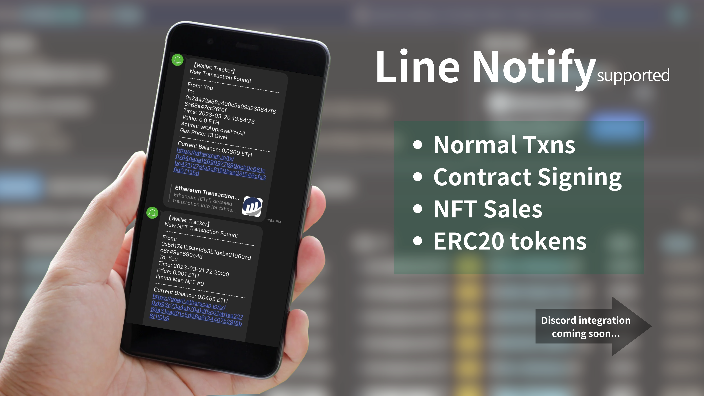

# Ethereum Wallet Tracker

📖 [繁體中文版README.md](#以太坊錢包交易通知機器人) 📖

## A bot notifies you when new transaction appears


This bot is designed to notify you when there is a new transaction on the tracked wallet addresses happened. It supports
both Ethereum mainnet and Goerli testnet in case you are a developer. Notifications can be sent by Line Notify or
Discord bot.



Project progress:

| TODO LIST           | Support |
|:--------------------|:-------:|
| Line-Notify support |   ☑️    |
| Discord bot support |   🛠️   |
| Normal txns         |   ☑️    |
| Internal txns       |   ☑️    |
| ERC20 token txns    |   ☑️    |
| ERC721 token txns   |   ☑️    |
| ERC1155 token txns  |   ❌️    |

☑️ Supported | 🛠️ In progress | ❌️ Not supported yet

---

## Getting started to use the bot

### How to host yourself

1. Download the latest release from [here](https://github.com/HappyGroupHub/Ethereum-Wallet-Tracker/releases)
2. Unzip the file then open up `config.yml`, [Notepad++](https://notepad-plus-plus.org/downloads/) editor is recommended
3. Fill in the following required information, see [here](#About-configyml) for more details
4. Now run `WalletTracker.exe` to start the bot
5. Make sure you've added your Line Bot / Line Notify as a friend
6. Enjoy!

### About config.yml

```yaml
# ++--------------------------------++
# | Ethereum Wallet Tracker  ver.    |
# | Made by LD & K                   |
# ++--------------------------------++

# Paste your endpoint for the webhook here.
# You can use ngrok to get a free static endpoint now!
# Find out more here: https://ngrok.com/
# Notes: Make sure the webhook url is started with https:// and ended without a slash (/)
webhook_url: ''

# Paste your Etherscan api key and Alchemy Webhook Auth Token here.
# Etherscan: https://etherscan.io/myapikey
# Alchemy: https://dashboard.alchemyapi.io/webhooks
etherscan_api_key: ''
alchemy_webhook_auth_token: ''

# Paste yor Line Bot and Line Notify tokens and secrets here.
# Line bot: https://developers.line.biz/console/
# Line Notify: https://notify-bot.line.me/my/services/
line_channel_access_token: ''
line_channel_secret: ''
line_notify_id: ''
line_notify_secret: ''
```

### How to get Webhook URL and what is it?

Basically, a webhook URL is an endpoint that other services can send us messages. In this case, we will use it to
receive messages from Line and Discord, so the value of `webhook_url` should be the URL(with HTTPS) of your server.
You can find out an easy way by using [ngrok](https://ngrok.com/), and here is
a [tutorial](#Use-Ngrok-to-create-a-static-reverse-proxy) for it.

### How to get Etherscan API key

1. Go to [Etherscan](https://etherscan.io/myapikey) and sign up for an account
2. Login to your account and click `+ Add` in the top right corner
3. Enter the App Name as `ETH Wallet Tracker` and click `Create New API Key`
4. Done! You can now copy your API key

### How to get Alchemy Webhook Auth Token

1. Go to [Alchemy](https://dashboard.alchemyapi.io/webhooks) and sign up for an account
2. Login to your account and click `Auth token` in the top right corner
3. Done! You can now copy your auth token

### How to get Line channel access token and secret

1. Go to [Line Developers](https://developers.line.biz/console/) and login with your Line account
2. If you don't have a Business ID, simply create one by following the instructions
3. Then click `Create a new provider`
4. Fill in the required information and click `Create`
5. Click `Create a new channel` and select `Messaging API`
6. Fill in the required information and click `Create`
7. You can now find your channel secret in Basic settings and channel access token in Message API, click `Issue` to copy
   it

Notes: Please make sure you've **checked** `Allow bot to join group chats` option and **un-checked**
`Auto-reply messages`in your Line bot settings, which can be found in `Messaging API` > `LINE Official Account features`
section.

### Setting up Line webhook

1. Go to [Line Developers](https://developers.line.biz/console/) and login with your Line account
2. Select your channel application
3. Select Messaging API, find `Webhook URL` and click edit
4. Fill in your webhook URL and add `/callback` at the end
5. Click `Save` and it's pretty done!
6. Remember to check `Use webhook` under the `Webhook URL` section

Notes: Line webhook only works with HTTPS, so you need to use a reverse proxy to make it work.
If you don't know how to create a reverse proxy, you can use [ngrok](https://ngrok.com/) to create one easily,
find out how to use it [here](#Use-Ngrok-to-create-a-static-reverse-proxy).

### How to get Line Notify client ID and secret

1. Go to [Line Notify](https://notify-bot.line.me/my/services/) and login with your Line account
2. Click `Add service`
3. Fill in the service name with `ETH Wallet Tracker`
4. Fill in the Callback URL with your webhook URL and add `/notify` at the end
5. Fill in other required information then click `Agree and continue`
6. You can now find your client ID and secret at the top of the page

### Use Ngrok to create a static reverse proxy

1. Go to [Ngrok](https://ngrok.com) sign up for an account and login
2. Click `+ New Domain` at the [Domains Dashboard](https://dashboard.ngrok.com/cloud-edge/domains), copy the domain
   name you created, which should be something like `sometihng-random-idontknow.ngrok-free.app`
3. Download the latest version of ngrok from [here](https://ngrok.com/download)
4. Extract the zip file you downloaded and run `ngrok.exe`
5. Run `ngrok config edit`, it'll open up a text editor
6. Replace the whole file with the following content
    ```yaml
    authtoken: <your_auth_token>
    version: 2
    tunnels:
        app:
            proto: http
            hostname: <domain_name>
            addr: 127.0.0.1:5000
    ```
    - Replace `<domain_name>` with the domain name you created at step 3
    - Replace `<your_auth_token>` with your auth token, which can be found
      at [here](https://dashboard.ngrok.com/get-started/your-authtoken)
7. Now save the config file then run `ngrok start app` at the command line
8. Copy the URL from `Fowarding`, it should be the same as the domain name you created at step 3
9. Done! Now you can use this URL as your webhook URL

---

## Contribute to this project

### How to contribute

1. Fork this repository
2. Clone your forked repository
3. Create a new branch
4. Make your changes
5. Commit and push your changes
6. Create a pull request
7. Wait for review

### Libraries used

* [PyYAML](https://github.com/yaml/pyyaml) for reading config file
* [requests](https://github.com/psf/requests) for sending HTTP requests
* [line-bot-sdk](https://github.com/line/line-bot-sdk-python) for Line bot usage
* [fastapi](https://github.com/tiangolo/fastapi) for the webhook server
* [uvicorn](https://github.com/encode/uvicorn) for running the webhook server
* [python-multipart](https://github.com/andrew-d/python-multipart) for parsing multipart/form-data

### Code style and commits

* 100 characters per line
* Use `snake_case` for variables and functions
* Add a blank line at the end of the file
* Optimize imports, remove the redundant ones
* [Google style](https://google.github.io/styleguide/pyguide.html) TODO comments
* Use [Sphinx Docstring](https://sphinx-rtd-tutorial.readthedocs.io/en/latest/docstrings.html) style for docstrings
* Use these headers for commits
  - Update - your commit messages here
  - Fix bug - your commit messages here
  - Optimize - your commit messages here
  - Standardize - your commit messages here

### Find bugs or having suggestions?

If you have any suggestions or found any bugs, please open an
issue [here](https://github.com/HappyGroupHub/Ethereum-Wallet-Tracker/issues), will try to fix it as soon as possible.

### Support this project

If you find this project useful, consider **starring** this repository to show your support! or donating any
cryptocurrencies to the following addresses

Ethereum address: `hot.happygroup.eth`

### License

This project is licensed under the MIT License - see the [LICENSE](LICENSE) file for details

---

# 以太坊錢包交易通知機器人

📖 [English README.md](#Ethereum-Wallet-Tracker) 📖

## 以太坊錢包交易通知機器人


此專案的機器人可以讓你追蹤一個以太坊錢包的交易活動，並在有新的交易發生時，透過Line Notify或Discord bot來通知您! 同時支援開法者使用
Goerli 測試網路。


專案進度:

| 完成列表              | 進度  |
|:------------------|:---:|
| 支援 Line-Notify 通知 | ☑️  |
| 支援 Discord 機器人通知  | 🛠️ |
| 一般的交易活動           | ☑️  |
| 內部交易活動            | ☑️  |
| ERC20 代幣活動        | ☑️  |
| ERC721 代幣活動       | ☑️  |
| ERC1155 代幣活動      | ❌️  |

☑️ 已支援 | 🛠️ 開發中... | ❌️ 尚未開發

---

## 開始使用

### 如何下載及運行

1. 從 [這裡](https://github.com/HappyGroupHub/Ethereum-Wallet-Tracker/releases) 下載最新的版本
2. 解壓縮檔案後，於資料夾內開啟 `config.yml`, 建議使用[Notepad++](https://notepad-plus-plus.org/downloads/)來編輯檔案
3. 遵照內文完成填寫 `config.yml`，請參考 [這裡](#關於-configyml)
4. 運行 `WalletTracker.exe`
5. 確認你已經將你的 Line Bot / Line Notify 加為好友
6. 盡情使用!

### 關於 config.yml

```yaml
# ++--------------------------------++
# | Ethereum Wallet Tracker  ver.    |
# | Made by LD & K                   |
# ++--------------------------------++

# Paste your endpoint for the webhook here.
# You can use ngrok to get a free static endpoint now!
# Find out more here: https://ngrok.com/
# Notes: Make sure the webhook url is started with https:// and ended without a slash (/)
webhook_url: ''

# Paste your Etherscan api key and Alchemy Webhook Auth Token here.
# Etherscan: https://etherscan.io/myapikey
# Alchemy: https://dashboard.alchemyapi.io/webhooks
etherscan_api_key: ''
alchemy_webhook_auth_token: ''

# Paste yor Line Bot and Line Notify tokens and secrets here.
# Line bot: https://developers.line.biz/console/
# Line Notify: https://notify-bot.line.me/my/services/
line_channel_access_token: ''
line_channel_secret: ''
line_notify_id: ''
line_notify_secret: ''
```

### 什麼是 Webhook URL? 我該怎麼獲取它?

簡單來說，Webhook URL 是其他服務可以用來將訊息發送給我們的端點網址。而我們將使用它來接收來自 Line 和 Discord
的訊息，所以 `webhook_url` 的值應該是你伺服器的對外URL網址(需為HTTPS協議)。你可以使用 [ngrok](https://ngrok.com/)
來簡單的達成此目標，請參考 [這裡的教學](#使用-Ngrok-建立符合-HTTPS-協議的端點網址)

### 獲取 Etherscan API key

1. 前往 [Etherscan](https://etherscan.io/myapikey) 註冊一個帳號並登入
2. 進入上述網址並點擊位於右上角的 `+ Add`
3. 在 App Name 欄位輸入 `ETH Wallet Tracker` 並點擊 `Create New API Key`
4. 完成! 你現在可以在頁面上複製你的 API key 囉

### 獲取 Alchemy Webhook Auth Token

1. 前往 [Alchemy](https://dashboard.alchemyapi.io/webhooks) 註冊一個帳號並登入
2. 進入上述網址並點擊位於右上角的 `Auth token`
3. 完成! 你現在可以在頁面上複製你的 auth token 囉


### 獲取 Line channel access token 及 secret

1. 前往 [Line Developers](https://developers.line.biz/console/) 並使用你的Line帳號登入
2. 如果你沒有 Business ID，請按照官網的指示建立一個
3. 點擊 `Create a new provider`
4. 填寫完需要的資料後點擊 `Create`
5. 點擊 `Create a new channel` 並選擇 `Messaging API` 的分類
6. 填寫完需要的資料後點擊 `Create`
7. 現在你可以在 Basic settings 找到你的 `channel secret` 以及在 Message API 找到 `channel access token`，點擊 `Issue` 來複製

註：請確保你在 Line 機器人設定中的 `Messaging API` > `LINE Official Account features`， **勾選**
`Allow bot to join group chats` 選項，並 **取消勾選** `Auto-reply messages` 選項

### 設定 Line Webhook

1. 前往 [Line Developers](https://developers.line.biz/console/) 並使用你的Line帳號登入
2. 點擊你要使用的 `channel application`
3. 選擇 Messaging API 分類, 找到 `Webhook URL` 並點擊 `edit`
4. 貼上你的 Webhook URL 並在尾處加上 `/callback`
5. 點擊 `Save`
6. 在 `Webhook URL` 底下勾選 `Use webhook`

註：Line Webhook 僅適用於 `HTTPS` 協議，恕不接受任何未經認證過的網址
如果你不知道如何申請，可以使用 [ngrok](https://ngrok.com/)
創建一個簡單的導向服務，請參考 [這裡的教學](#使用-Ngrok-建立符合-HTTPS-協議的端點網址)

### 獲取 Line Notify client ID 及 secret

1. 前往 [Line Notify](https://notify-bot.line.me/my/services/)，並使用您的 Line 帳號登入
2. 點擊 `Add service`
3. 在 Service Name 欄位輸入 `ETH Wallet Tracker`
4. 在 Callback URL 欄位輸入您的 Webhook URL，並在尾處加上 `/notify`
5. 填寫其他必要資訊，然後點擊 `Agree and continue`
6. 您現在可以在頁面頂部找到您的客戶端 ID 和密鑰

### 獲取 Discord bot token

1. 前往 [Discord Developer Portal](https://discord.com/developers/applications) 並使用你的Discord帳號登入
2. 點擊 `New Application`
3. 幫此機器人取名為 `Line訊息` 後點擊 `Create`
4. 點擊左側列表的 `Bot`
5. 點擊 `Add Bot`
6. 在 `Privileged Gateway Intents` 底下將 `Presence Intent`, `Server Members Intent` 及 `Message Content Intent` 都打勾
7. 現在你可以在 `Build-A-Bot` 底下找到你的 bot token，點擊 `Reset Token` 來複製

### 使用 Ngrok 建立符合 HTTPS 協議的端點網址

1. 前往 [Ngrok](https://ngrok.com) 註冊一個帳號並登入
2. 在 [Domains Dashboard](https://dashboard.ngrok.com/cloud-edge/domains) 中點擊 `+ New Domain`
   ，複製您所建立的網域名稱，成功的話應該會長這樣 `something-random-idontknow.ngrok-free.app`
3. 從 [這裡](https://ngrok.com/download) 下載最新版本的 ngrok 程式
4. 解壓縮你下載的 zip 檔案，然後執行 `ngrok.exe`
5. 執行 `ngrok config edit`，它會打開一個文字編輯器
6. 複製以下並完全替代原本的內容
    ```yaml
    authtoken: <your_auth_token>
    version: 2
    tunnels:
        app:
            proto: http
            hostname: <domain_name>
            addr: 127.0.0.1:5000
    ```
    - 把 `<domain_name>` 替換為您在步驟3所建立的網域名稱
    - 把 `<your_auth_token>` 替換為您的授權金鑰，您可以在 [這裡](https://dashboard.ngrok.com/get-started/your-authtoken)
      找到
7. 現在儲存檔案並關閉，繼續在命令行中執行 `ngrok start app`
8. 複製 `Fowarding` 所生成的URL，它應該與您在步驟3中創建的網域名稱相同
9. 完成！現在你可以將此 URL 作為你的 Webhook URL

---

## 協助這個專案開發

### 如何貢獻

1. Fork 這個專案
2. 複製你剛剛 Fork 的專案至本地
3. 建立新的分支
4. 盡情發揮你的能力
5. Commit / Push 你的程式碼
6. 建立新的 Pull Request
7. 等待回覆

### 使用的函式庫

* [PyYAML](https://github.com/yaml/pyyaml) 用來讀取 yaml 格式的設定檔
* [requests](https://github.com/psf/requests) 用來發送 HTTP 請求
* [line-bot-sdk](https://github.com/line/line-bot-sdk-python) 用來操作並設定 Line Bot
* [fastapi](https://github.com/tiangolo/fastapi) 用來建立 webhook server
* [uvicorn](https://github.com/encode/uvicorn) 用來運行 webhook server
* [python-multipart](https://github.com/andrew-d/python-multipart) 用來解析 multipart/form-data

### 程式碼撰寫/提交規範

* 每行不超過100個字元
* 使用 `snake_case` 命名變數及函式
* 在檔案尾處加上一個空行
* 最佳化程式碼並移除不必要的import
* [Google style](https://google.github.io/styleguide/pyguide.html) TODO註解
* 使用 [Sphinx Docstring](https://sphinx-rtd-tutorial.readthedocs.io/en/latest/docstrings.html) 進行函式註解
* 提交請求時請使用以下格式，並全英文撰寫
  - Update - your commit messages here
  - Fix bug - your commit messages here
  - Optimize - your commit messages here
  - Standardize - your commit messages here

### 建議/問題回報

如果你有任何建議或是發現了任何問題，請在 [Issues](https://github.com/HappyGroupHub/Ethereum-Wallet-Tracker/issues)
提交你的意見，我會盡快回覆你!

### 支持我做出更多開源內容

如果你覺得這個專案對你有幫助，歡迎按下右上角的 **Star** 來追蹤此專案! 也可以透過加密貨幣捐款來支持我做出更多開源內容

以太坊錢包地址: `hot.happygroup.eth`

### 版權

此專案的版權規範採用 **MIT License** - 至 [LICENSE](LICENSE) 查看更多相關聲明
